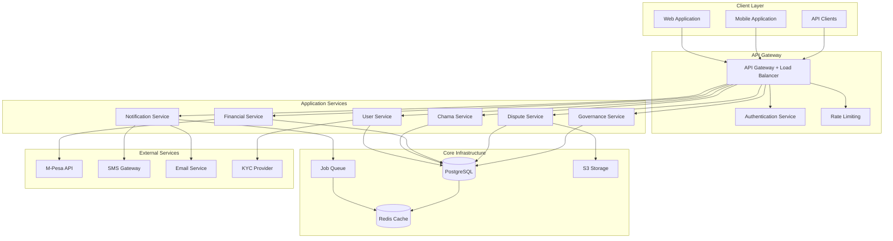

# Design Document: Chama Management System

## Overview

The Chama Management System is a comprehensive platform designed to manage savings groups (Chamas) across East Africa. The system supports three distinct Chama types (ROSCA, ASCA, NORMAL) with robust financial management, dispute resolution, governance tools, and multi-platform access. 

The architecture emphasizes financial accuracy, regulatory compliance, and real-world operational challenges including member disputes, loan defaults, and complex governance scenarios. The system provides both web and mobile access with offline capabilities for areas with limited connectivity.

## Architecture

### High-Level Architecture



### Technology Stack

**Backend:**
- **Runtime:** Node.js with Express.js framework
- **Database:** PostgreSQL with Prisma ORM for type-safe database access
- **Authentication:** JWT tokens with refresh token rotation
- **Validation:** Zod schemas for runtime type validation
- **Cache:** Redis for session management and performance optimization
- **Queue:** Bull/BullMQ for background job processing
- **Storage:** S3-compatible storage for documents and evidence

**Frontend:**
- **Web:** React with TypeScript for type safety
- **Mobile:** React Native for cross-platform mobile development
- **State Management:** Redux Toolkit for complex state management
- **Offline Support:** Redux Persist with conflict resolution

**External Integrations:**
- **Payments:** M-Pesa API for mobile money transactions
- **Communications:** SMS gateway and email service for notifications
- **KYC:** Third-party identity verification service
- **Monitoring:** Application performance monitoring and logging

## Components and Interfaces

### User Management Component

**Responsibilities:**
- User authentication and authorization
- Multi-Chama membership management
- Role-based access control
- KYC compliance and verification

**Key Interfaces:**

```typescript
interface User {
  id: string;
  email: string;
  phone: string;
  nationalId: string;
  kycStatus: 'pending' | 'verified' | 'rejected';
  memberships: ChamaMembership[];
  createdAt: Date;
  updatedAt: Date;
}

interface ChamaMembership {
  chamaId: string;
  userId: string;
  role: 'founder' | 'chair' | 'treasurer' | 'secretary' | 'auditor' | 'member';
  status: 'pending' | 'active' | 'suspended' | 'exited';
  joinedAt: Date;
  reliabilityScore: number;
}

interface AuthTokens {
  accessToken: string;
  refreshToken: string;
  expiresAt: Date;
}
```

### Chama Management Component

**Responsibilities:**
- Chama creation and configuration
- Member invitation and approval
- Type-specific rule enforcement
- Public directory and discovery

**Key Interfaces:**

```typescript
interface Chama {
  id: string;
  name: string;
  type: 'ROSCA' | 'ASCA' | 'NORMAL';
  description: string;
  maxMembers: number;
  contributionAmount: number;
  contributionFrequency: 'weekly' | 'monthly';
  currency: string;
  visibility: 'public' | 'private' | 'invite_only';
  shareableLink: string;
  qrCode: string;
  status: 'active' | 'suspended' | 'closed';
  settings: ChamaSettings;
  createdAt: Date;
}

interface ChamaSettings {
  roscaSettings?: ROSCASettings;
  ascaSettings?: ASCASettings;
  normalSettings?: NormalSettings;
  governanceRules: GovernanceRules;
  penaltyRules: PenaltyRules;
}

interface ROSCASettings {
  payoutSchedule: PayoutSchedule[];
  currentPayoutIndex: number;
}

interface ASCASettings {
  shareOutDate: Date;
  loanInterestRate: number;
  maxLoanAmount: number;
}
```

### Financial Management Component

**Responsibilities:**
- Contribution tracking and validation
- Loan management with guarantors
- Payment processing and reconciliation
- Financial reporting and audit trails

**Key Interfaces:**

```typescript
interface Contribution {
  id: string;
  chamaId: string;
  memberId: string;
  amount: number;
  dueDate: Date;
  paidDate?: Date;
  status: 'pending' | 'paid' | 'overdue' | 'partial';
  paymentMethod: 'mpesa' | 'bank' | 'cash';
  transactionRef?: string;
  penalties: number;
}

interface Loan {
  id: string;
  chamaId: string;
  borrowerId: string;
  amount: number;
  interestRate: number;
  guarantors: LoanGuarantor[];
  status: 'pending' | 'approved' | 'active' | 'defaulted' | 'paid';
  disbursedAt?: Date;
  dueDate: Date;
  balance: number;
  riskScore: number;
}

interface LoanGuarantor {
  memberId: string;
  guaranteedAmount: number;
  collateralLocked: number;
  status: 'active' | 'released' | 'claimed';
}

interface Transaction {
  id: string;
  chamaId: string;
  type: 'contribution' | 'loan_disbursement' | 'loan_payment' | 'payout' | 'penalty';
  amount: number;
  fromMemberId?: string;
  toMemberId?: string;
  reference: string;
  idempotencyKey: string;
  status: 'pending' | 'completed' | 'failed' | 'reversed';
  createdAt: Date;
}
```

### Dispute Resolution Component

**Responsibilities:**
- Dispute creation and evidence management
- Resolution workflow orchestration
- Immutable audit trails
- Automated remedy implementation

**Key Interfaces:**

```typescript
interface Dispute {
  id: string;
  chamaId: string;
  raisedBy: string;
  againstMember?: string;
  relatedTransaction?: string;
  category: 'contribution' | 'loan' | 'payout' | 'governance' | 'other';
  description: string;
  evidence: Evidence[];
  status: 'open' | 'under_review' | 'voting' | 'resolved' | 'closed';
  resolution?: DisputeResolution;
  createdAt: Date;
  immutableHash: string;
}

interface Evidence {
  id: string;
  type: 'document' | 'image' | 'screenshot' | 'receipt';
  filename: string;
  s3Key: string;
  uploadedBy: string;
  uploadedAt: Date;
  hash: string;
}

interface DisputeResolution {
  resolvedBy: string;
  resolution: string;
  remedy: 'no_action' | 'refund' | 'adjustment' | 'suspension' | 'custom';
  remedyDetails?: any;
  votingResults?: VotingResults;
  resolvedAt: Date;
}
```

### Governance Component

**Responsibilities:**
- Voting mechanism management
- Quorum enforcement
- Decision execution
- Governance audit trails

**Key Interfaces:**

```typescript
interface Vote {
  id: string;
  chamaId: string;
  title: string;
  description: string;
  type: 'simple_majority' | 'weighted_contribution' | 'role_restricted';
  options: VoteOption[];
  quorumRequired: number;
  startDate: Date;
  endDate: Date;
  status: 'draft' | 'active' | 'completed' | 'cancelled';
  isAnonymous: boolean;
  autoExecute: boolean;
}

interface VoteOption {
  id: string;
  text: string;
  votes: VoteCast[];
  weight: number;
}

interface VoteCast {
  memberId: string;
  optionId: string;
  weight: number;
  castAt: Date;
  isAnonymous: boolean;
}

interface GovernanceRules {
  votingRules: VotingRules;
  quorumPercentage: number;
  decisionThreshold: number;
  votingPeriodDays: number;
}
```

### Notification Component

**Responsibilities:**
- Multi-channel notification delivery
- Priority-based routing
- Delivery tracking and acknowledgments
- Offline notification queuing

**Key Interfaces:**

```typescript
interface Notification {
  id: string;
  recipientId: string;
  chamaId?: string;
  type: 'contribution_due' | 'meeting_reminder' | 'loan_overdue' | 'dispute_raised' | 'vote_started';
  priority: 'critical' | 'important' | 'info';
  title: string;
  message: string;
  channels: NotificationChannel[];
  status: 'pending' | 'sent' | 'delivered' | 'failed';
  scheduledFor?: Date;
  sentAt?: Date;
  acknowledgedAt?: Date;
}

interface NotificationChannel {
  type: 'sms' | 'email' | 'push' | 'in_app';
  address: string;
  status: 'pending' | 'sent' | 'delivered' | 'failed';
  deliveredAt?: Date;
  errorMessage?: string;
}

interface NotificationPreferences {
  memberId: string;
  smsEnabled: boolean;
  emailEnabled: boolean;
  pushEnabled: boolean;
  quietHours: { start: string; end: string };
  priorityOverride: boolean;
}
```

## Data Models

### Core Entity Relationships

```mermaid
erDiagram
    User ||--o{ ChamaMembership : has
    Chama ||--o{ ChamaMembership : contains
    Chama ||--o{ Contribution : requires
    Chama ||--o{ Loan : provides
    Chama ||--o{ Transaction : records
    Chama ||--o{ Dispute : handles
    Chama ||--o{ Vote : conducts
    
    User ||--o{ Contribution : makes
    User ||--o{ Loan : borrows
    User ||--o{ LoanGuarantor : guarantees
    User ||--o{ Dispute : raises
    User ||--o{ VoteCast : casts
    User ||--o{ Evidence : uploads
    
    Loan ||--o{ LoanGuarantor : secured_by
    Dispute ||--o{ Evidence : supported_by
    Vote ||--o{ VoteOption : contains
    VoteOption ||--o{ VoteCast : receives
    
    Transaction ||--|| User : from
    Transaction ||--|| User : to
    
    User {
        string id PK
        string email UK
        string phone UK
        string nationalId UK
        enum kycStatus
        timestamp createdAt
        timestamp updatedAt
    }
    
    Chama {
        string id PK
        string name
        enum type
        string description
        integer maxMembers
        decimal contributionAmount
        enum contributionFrequency
        string currency
        enum visibility
        string shareableLink UK
        string qrCode
        enum status
        json settings
        timestamp createdAt
    }
    
    ChamaMembership {
        string chamaId PK,FK
        string userId PK,FK
        enum role
        enum status
        decimal reliabilityScore
        timestamp joinedAt
        timestamp updatedAt
    }
    
    Contribution {
        string id PK
        string chamaId FK
        string memberId FK
        decimal amount
        date dueDate
        timestamp paidDate
        enum status
        enum paymentMethod
        string transactionRef
        decimal penalties
        timestamp createdAt
    }
    
    Loan {
        string id PK
        string chamaId FK
        string borrowerId FK
        decimal amount
        decimal interestRate
        enum status
        timestamp disbursedAt
        date dueDate
        decimal balance
        decimal riskScore
        timestamp createdAt
    }
    
    Transaction {
        string id PK
        string chamaId FK
        enum type
        decimal amount
        string fromMemberId FK
        string toMemberId FK
        string reference UK
        string idempotencyKey UK
        enum status
        timestamp createdAt
    }
    
    Dispute {
        string id PK
        string chamaId FK
        string raisedBy FK
        string againstMember FK
        string relatedTransaction FK
        enum category
        text description
        enum status
        json resolution
        string immutableHash UK
        timestamp createdAt
    }
    
    Vote {
        string id PK
        string chamaId FK
        string title
        text description
        enum type
        integer quorumRequired
        timestamp startDate
        timestamp endDate
        enum status
        boolean isAnonymous
        boolean autoExecute
        timestamp createdAt
    }
```

### Financial Data Integrity

**Double-Entry Accounting Principles:**
- All financial transactions maintain balance (debits = credits)
- Immutable transaction logs with cryptographic hashing
- Periodic reconciliation jobs to verify data integrity
- Audit trails for all financial state changes

**Risk Management Data:**
- Member risk scores based on contribution history, loan performance, attendance
- Chama-level risk exposure tracking
- Guarantor collateral calculations and locking mechanisms
- Default prediction models using historical data

## Correctness Properties

*A property is a characteristic or behavior that should hold true across all valid executions of a system—essentially, a formal statement about what the system should do. Properties serve as the bridge between human-readable specifications and machine-verifiable correctness guarantees.*

Let me analyze the acceptance criteria to determine which ones can be tested as properties, examples, or edge cases.

Based on the prework analysis, I've identified the following testable properties after eliminating redundancy:

**Property 1: Authentication and Session Management**
*For any* user with valid credentials, the system should authenticate them with JWT tokens, automatically refresh expired tokens, and maintain proper session state across role switches
**Validates: Requirements 1.1, 1.2, 1.3**

**Property 2: Access Control Enforcement**
*For any* user action, the system should grant access only when the user has appropriate permissions for their role, and deny all unauthorized attempts with proper logging
**Validates: Requirements 1.4, 14.1**

**Property 3: Chama Discovery and Information Display**
*For any* Chama link access, the system should display comprehensive and accurate information including type, contribution details, rules, and member benefits
**Validates: Requirements 2.2, 3.1, 6.1**

**Property 4: Member Invitation and Registration**
*For any* member invitation or registration, the system should create secure links, collect required KYC information, and provide proper approval workflows
**Validates: Requirements 2.1, 4.1, 19.1**

**Property 5: Multi-Chama Dashboard Consistency**
*For any* member with multiple Chama memberships, the dashboard should accurately display all participations with correct metrics and role indicators
**Validates: Requirements 5.1**

**Property 6: Chama Type Configuration Enforcement**
*For any* Chama creation, the system should enforce type-specific requirements and prevent operations incompatible with the chosen type
**Validates: Requirements 7.1**

**Property 7: Financial Transaction Recording**
*For any* financial operation, the system should create immutable transaction records with proper timestamps, amounts, and audit trails
**Validates: Requirements 8.2, 13.1, 20.4**

**Property 8: Notification Delivery**
*For any* system event requiring notification, the system should deliver messages through appropriate channels based on priority and member preferences
**Validates: Requirements 8.1, 12.1, 25.1**

**Property 9: Payment Processing and Reconciliation**
*For any* payment transaction, the system should process it with idempotency guarantees, provide confirmation, and automatically reconcile with member accounts
**Validates: Requirements 8.5, 15.1, 27.1**

**Property 10: ROSCA Payout Management**
*For any* ROSCA payout cycle, the system should correctly identify the next member in rotation, calculate payout amounts, and prevent duplicate payouts
**Validates: Requirements 9.1, 9.4**

**Property 11: Loan Eligibility and Interest Calculation**
*For any* loan request, the system should validate eligibility based on member history and calculate interest using configured tiered rates
**Validates: Requirements 10.1, 10.2**

**Property 12: ASCA Share-Out Balance Invariant**
*For any* ASCA share-out calculation, the total amount distributed should equal the total amount collected (balance to zero invariant)
**Validates: Requirements 11.1, 11.4**

**Property 13: Regulatory Compliance Reporting**
*For any* compliance report request, the system should generate reports in standard formats with complete and accurate data
**Validates: Requirements 13.4**

**Property 14: Dispute Management and Evidence Handling**
*For any* dispute raised, the system should create formal records with evidence upload capability and maintain immutable logs
**Validates: Requirements 20.1, 20.4**

**Property 15: Loan Default and Guarantor Management**
*For any* loan issuance, the system should require guarantors with collateral locking, and automatically handle defaults through payout freezing and deductions
**Validates: Requirements 21.1, 21.3**

**Property 16: Voting Integrity and Execution**
*For any* governance vote, the system should enforce quorum rules, prevent manipulation, and automatically execute approved decisions
**Validates: Requirements 22.2, 22.5**

**Property 17: Member Exit Settlement Calculation**
*For any* member exit scenario, the system should calculate prorated settlements including all contributions, loans, and entitlements
**Validates: Requirements 23.3**

**Property 18: Offline Synchronization**
*For any* offline transaction, the system should queue it for synchronization and properly handle conflicts when connectivity is restored
**Validates: Requirements 26.2**

## Error Handling

### Financial Error Recovery

**Transaction Failures:**
- All financial operations use database transactions with rollback capability
- Failed payments are retried with exponential backoff
- Partial failures are logged and require manual intervention
- Idempotency keys prevent duplicate processing

**Data Consistency Errors:**
- Periodic reconciliation jobs verify financial balances
- Discrepancies trigger alerts and automatic correction attempts
- Critical errors freeze affected operations until resolution
- All corrections maintain full audit trails

### Dispute Resolution Errors

**Evidence Handling:**
- Failed evidence uploads are retried automatically
- Corrupted files are detected through hash verification
- Storage failures maintain local copies until successful upload
- Evidence tampering is prevented through immutable hashing

**Workflow Errors:**
- Stuck disputes are escalated automatically after timeout periods
- Invalid state transitions are prevented and logged
- Resolution failures trigger rollback to previous state
- All dispute actions maintain immutable audit trails

### System Reliability

**Service Failures:**
- Circuit breakers prevent cascade failures
- Health checks monitor all critical services
- Automatic failover for database and cache layers
- Graceful degradation for non-critical features

**External Service Errors:**
- M-Pesa failures are retried with proper backoff
- SMS/Email failures use alternative channels
- KYC service failures allow manual verification
- Payment reconciliation handles delayed confirmations

## Testing Strategy

### Dual Testing Approach

The system requires both unit testing and property-based testing for comprehensive coverage:

**Unit Tests:**
- Focus on specific examples, edge cases, and error conditions
- Test integration points between components
- Verify error handling and boundary conditions
- Test specific business logic scenarios

**Property-Based Tests:**
- Verify universal properties across all inputs through randomization
- Test financial invariants and data consistency
- Validate security and access control across all scenarios
- Ensure system behavior under various load conditions

### Property-Based Testing Configuration

**Framework Selection:**
- **Node.js/TypeScript:** Use `fast-check` library for property-based testing
- **Minimum 100 iterations** per property test due to randomization requirements
- Each property test references its corresponding design document property
- Tag format: **Feature: chama-management-system, Property {number}: {property_text}**

**Test Categories:**

1. **Financial Properties:**
   - Balance invariants (total in = total out)
   - Transaction immutability
   - Interest calculation accuracy
   - Payment reconciliation correctness

2. **Security Properties:**
   - Access control enforcement
   - Authentication token validity
   - Data encryption and hashing
   - Audit trail completeness

3. **Business Logic Properties:**
   - Chama type rule enforcement
   - Member lifecycle management
   - Dispute resolution workflows
   - Governance voting integrity

4. **System Properties:**
   - Idempotency guarantees
   - Offline synchronization correctness
   - Notification delivery reliability
   - Error recovery completeness

### Integration Testing

**End-to-End Scenarios:**
- Complete member journey from registration to exit
- Full ROSCA cycle with contributions and payouts
- ASCA cycle with loans and share-out
- Dispute resolution from creation to remedy
- Multi-Chama member management

**Performance Testing:**
- Load testing with realistic user patterns
- Stress testing financial calculations
- Concurrency testing for critical operations
- Offline synchronization under various network conditions

**Security Testing:**
- Penetration testing for authentication and authorization
- Financial transaction security validation
- Data privacy and encryption verification
- Audit trail integrity testing

The testing strategy ensures that both specific scenarios and universal properties are thoroughly validated, providing confidence in the system's correctness and reliability for real-world Chama operations.